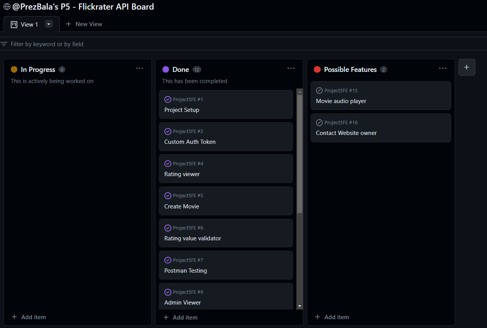

# FlickRater API- Project 5

The objective of this API is to serve as a robust backend mechanism for the Flickrater frontend application. It is specifically designed to facilitate seamless Create, Read, Update, and Delete (CRUD) operations through the user interface. This structure empowers users to interact with the application effectively and efficiently.

FlickRater API is the backend service used by the [Live link to the Repository](https://github.com/PrezBala/Project5FE)

# Table of contents

- [FlickRater API- Project 5](#flickrater-api--project-5)
- [Table of contents](#table-of-contents)
- [Development Goals](#development-goals)
- [Agile Planning](#agile-planning)
  - [Epics](#epics)
  - [Set Up](#set-up)
  - [Movie Creation](#movie-creation)
  - [Movie Description](#movie-description)
  - [Custom Auth Token](#custom-auth-token)
  - [Movie Rating](#movie-rating)
- [User Stories](#user-stories)
  - [Site Goals](#site-goals)
  - [Agile Planning](#agile-planning-1)
  - [User Stories](#user-stories-1)
- [API Endpoints](#api-endpoints)
- [Security](#security)
- [Technologies](#technologies)
  - [Python Packages](#python-packages)
- [Testing](#testing)
  - [Functional Testing](#functional-testing)
- [Deployment](#deployment)
- [Heroku Deployment](#heroku-deployment)
- [Credit](#credit)

# Development Goals

The objective of this API is to function as a backend service, enabling the FlickRater frontend application to carry out Create, Read, Update, and Delete operations through its user interface.

# Agile Planning

This project was developed following agile principles, with a series of four sprints. Each feature was prioritized and labeled as either "must-have," "should-have," or "could-have." We began by implementing the must-have features, followed by the should-have features, and finally addressed the could-have features if time and resources permitted. This approach ensured the delivery of a comprehensive website, with optional enhancements added based on capacity.

Our Kanban board, created using GitHub Projects, facilitated project management and can be accessed [here](https://github.com/users/PrezBala/projects/1/views/1). For more detailed information on each task, simply click on the respective view.

 

The user stories were grouped into different Epics

## Epics

## Set Up

This epic encompasses the crucial steps to get the Django application and Django REST Framework operational, creating a robust platform to start developing the features.

## Movie Creation

This epic focuses on the establishment of API endpoints and database integrations to support CRUD operations for the creation of movie posts, forming the backbone of movie content in the application.

## Movie Description

This epic is dedicated to designing and implementing API endpoints and database connections for the CRUD operations specifically related to the Movie description field, allowing for detailed storytelling and representation of each movie.

## Custom Auth Token

This epic targets the creation and handling of unique user tokens. It involves designing API endpoints and database interactions for CRUD operations of these tokens, providing a layer of security and personalization for each user in the system.

## Movie Rating

This epic covers the design and development of a comprehensive movie rating system. It includes creating API endpoints and database connections that allow users to rate each movie, offering a user-driven evaluation of each movie listing.

# User Stories

By Epics

Setup

As a developer, I need to create the base project set up so that I can build out the features.

As a developer, I need to create the google cloud bucket and create the connection to the project so that static images can be uploaded by users.

As a user I can create a new account so that I can access all the features for signed up users

Artists

As a developer, I want to create api views for artists so that they are available to the front end
Contact

As a developer, I want to create a contact model and API view so that users can contact the site owner with issues
Posts

As a user, I want to be able to view edit or delete a post
As a user, I want to able to create a post and list posts
Profiles

As a developer, I want to create a new blank profile with default image when a user is created.
As a user, I want to able to get a list of profiles

## Site Goals

## Agile Planning

## User Stories

# API Endpoints

- User Story - As a user, I want to easily view the main categories and navigate to the relevant one.

# Security

- User Story: As site owner, I want to share my name within the footer.

# Technologies

- User Story: As a user who is not logged in, I want to have the ability to explore forum posts created by other users.

Even without logging in, anyone can access the website to browse posts, navigate between categories, and read through all posts, comments, and replies

## Python Packages

- User Story: As a user, I want to search for topics of interest to discover if other users have shared similar thoughts or comments.

# Testing

User Stories

## Functional Testing

- User Story: As a user, I want to effortlessly share my questions or theories on the site so that I can exchange ideas with others.

Upon logging in, users can create their own posts using forms designed with Crispy Forms.

The image below showcases the mobile view, illustrating how the forms adapt to a smaller screen, ensuring a user-friendly experience on mobile devices.

# Deployment

- User Story: As a user, I want the ability to upload a profile picture for the new account I've just created.

# Heroku Deployment

- User Story: As a user, I want the ability to upload a profile picture for the new account I've just created.

# Credit

User Stories

[Back to Table of Contents](https://github.com/PrezBala/project4#table-of-contents)
